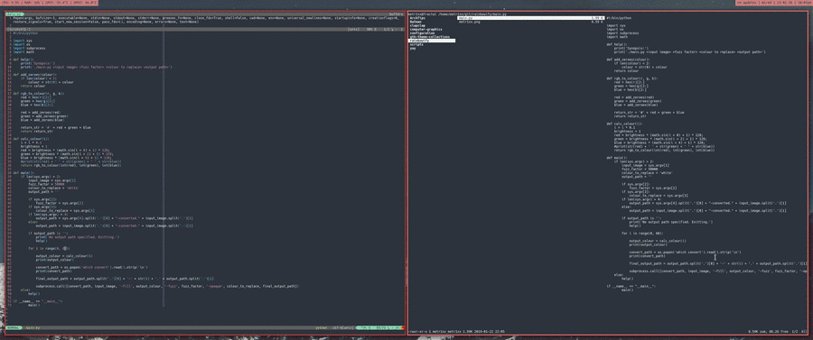

# Rainbowify

Give it an image, a colour to replace inside the image and a fuzz factor to make sure very similar colours get replaced aswell.

(requires imagemagick)

## Synopsis

./main.py \<input file\> \<fuzzy factor\> \<colour to replace\>

The fuzzy factor defaults to 50000 but can be set per command line. I will add proper command line options later

## Here's a demonstration:

the input image on the left and the output files compiled together to a gif on the right:
`./main.py metr1xx.png 50000 white`

 

The resulting files which can be easily converted to a gif with ffmpeg. (you can find the command in imgtogif.sh)

